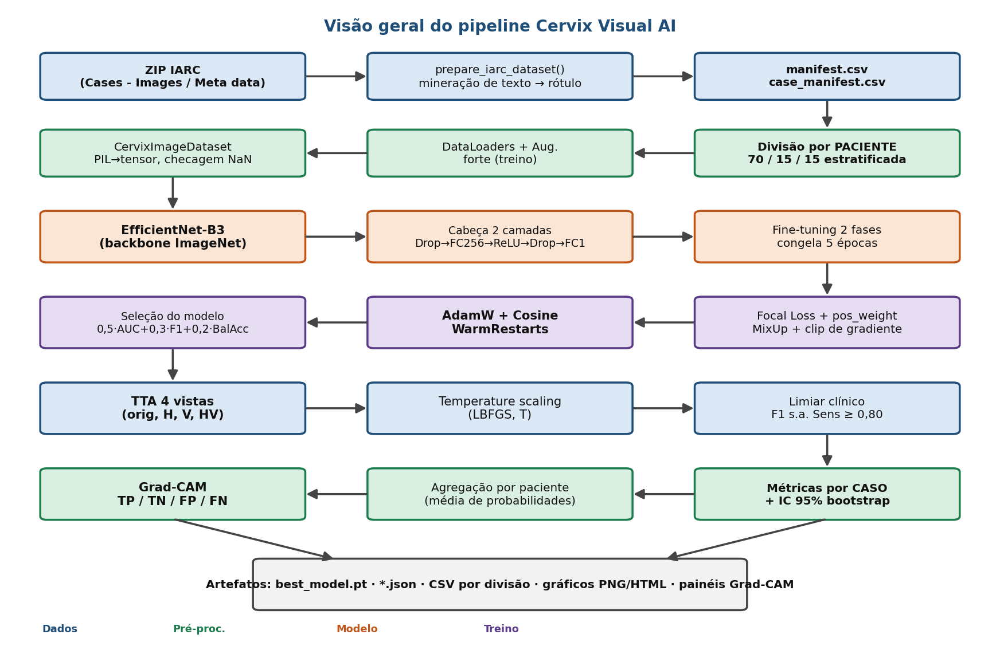
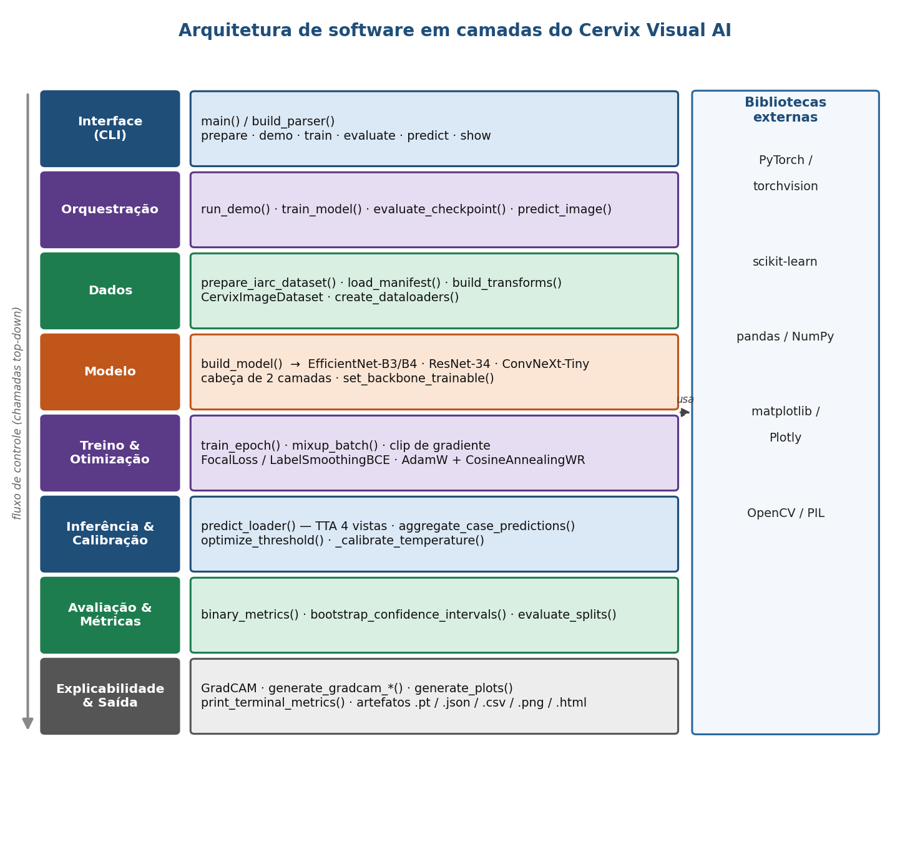

# Cervix Visual AI

Pipeline de aprendizado profundo, em **arquivo único** (Python), para a
**classificação binária** de imagens de **inspeção visual com ácido acético
(IVA)** do *IARC Cervical Image Bank* em:

- `negative_or_low_grade`
- `high_grade_or_cancer`

> ⚠️ **Aviso.** Artefato de **pesquisa exploratória**. Os resultados são
> experimentais e **não devem ser utilizados para decisão clínica**.

---

## ✨ Principais características

- **Backbone EfficientNet-B3** (com suporte a EfficientNet-B4, ResNet-34 e
  ConvNeXt-Tiny) com transferência de aprendizado em duas fases.
- **Divisão por paciente** (estratificada, sem vazamento de dados) e
  **agregação de predições por caso**.
- **Aumento agressivo de dados** + **MixUp** + recorte de norma de gradiente.
- **Focal Loss** (ou BCE com suavização de rótulos) com `pos_weight` de classe.
- **AdamW** + **CosineAnnealingWarmRestarts**.
- **TTA de 4 vistas** (original, flip H, flip V, flip HV).
- **Calibração por temperatura** (temperature scaling, L-BFGS).
- **Limiar de decisão com restrição de sensibilidade** (maximiza F1 com
  Sens ≥ 0,80).
- **Intervalos de confiança via bootstrap** (nível de caso).
- **Explicabilidade Grad-CAM** (exemplares TP/TN/FP/FN e conjunto completo).
- **Pré-treino de domínio opcional** (Intel & MobileODT) e **K-Fold** com
  ensemble *(funções avançadas presentes no código-fonte)*.

---

## 📦 Instalação

```bash
git clone https://github.com/<usuario>/cervix-visual-ai.git
cd cervix-visual-ai
python -m venv .venv
# Windows:  .venv\Scripts\activate
# Linux/Mac: source .venv/bin/activate
pip install -r requirements.txt
```

Requer **Python 3.10+**. Para aceleração por GPU, instale a build do PyTorch
correspondente à sua versão de CUDA (ver https://pytorch.org).

---

## 🚀 Uso

O script expõe subcomandos via linha de comando:

```bash
# 1. Preparar os dados a partir do ZIP do IARC Cervical Image Bank
python src/cervix_visual_ai.py prepare --zip "IARC EXAME VISUAL.zip"

# 2. Treinar o modelo
python src/cervix_visual_ai.py train

# 3. Avaliar um checkpoint (com TTA multi-escala opcional)
python src/cervix_visual_ai.py evaluate --tta-scales 320 384 456

# 4. Inferência em uma imagem
python src/cervix_visual_ai.py predict --image caminho/para/imagem.jpg

# 5. Visualizar imagens / Grad-CAM no terminal
python src/cervix_visual_ai.py show --image caminho/para/imagem.jpg
```

| Comando    | Função                                                            |
|------------|-------------------------------------------------------------------|
| `prepare`  | Extrai o ZIP da IARC e gera os manifestos (`manifest.csv`).        |
| `demo`     | `prepare` seguido de um treino com hiperparâmetros fixos.          |
| `train`    | Treino configurável (arquitetura, perda, limiar, temperatura…).    |
| `evaluate` | Reexecuta a avaliação sobre um checkpoint salvo.                   |
| `predict`  | Inferência em imagem única (probabilidade calibrada + rótulo).    |
| `show`     | Exibe imagens ou mapas Grad-CAM no terminal.                       |

> O acesso às imagens do **IARC Cervical Image Bank** está sujeito aos termos
> da IARC e **não** acompanha este repositório:
> https://screening.iarc.fr/cervicalimagebank.php

---

## 🗂️ Estrutura do repositório

```
cervix-visual-ai/
├── README.md
├── LICENSE
├── requirements.txt
├── .gitignore
├── src/
│   └── cervix_visual_ai.py        # pipeline completo (arquivo único)
└── docs/
    ├── relatorio_sbc.docx         # relatório técnico (formato SBC)
    ├── relatorio_sbc.pdf
    ├── figures/                   # diagramas (processo, arquitetura, UML…)
    └── scripts/                   # geradores dos diagramas e do relatório
```

---

## 🏗️ Arquitetura

A visão de processo e a arquitetura de software em camadas estão documentadas
em [`docs/relatorio_sbc.pdf`](docs/relatorio_sbc.pdf).





---

## 📄 Documentação

O relatório técnico completo (formato de artigo da **SBC**), descrevendo
proposta, desenvolvimento e avaliação, está em
[`docs/relatorio_sbc.pdf`](docs/relatorio_sbc.pdf). Os diagramas podem ser
regenerados com os scripts em `docs/scripts/`.

---

## 📚 Citação

```bibtex
@misc{cervixvisualai,
  title  = {Cervix Visual AI: Pipeline de Aprendizado Profundo para
            Classificacao de Lesoes Cervicais em Imagens de IVA},
  author = {[Nome do Autor]},
  year   = {2026},
  note   = {Artefato de pesquisa experimental}
}
```

---

## ⚖️ Licença

Distribuído sob a licença **MIT**. Veja [`LICENSE`](LICENSE).
